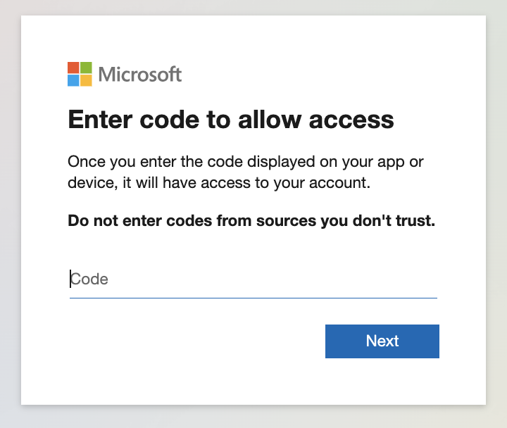

# noCAP
The purpose of NoCAP is to identify common misconfigurations in Conditional Access Policies (CAPs) within Microsoft Entra ID, which may be abused by threat actors to gain unauthorized access to a victim's Microsoft Azure and/or Microsoft 365 environment. 

## Key Features
* Export all CAPs and set conditions
* Export all defined user or group CAP exemptions 
* Identify any CAP-exempt users or groups and noteworthy Entra ID role assignments 
* Identify CAPs with potentially missing client apps 
* Identify contradictory M365 CAPs (e.g. a CAP that includes the Exchange Online app but excludes the Office 365 app)
* Identify sensitive CAP-exempt Entra ID role assignments (fuller role mapping is still in development) 

## Prerequisites
* Ensure that the account used to run the tool has at least the "Security Reader" Entra ID role assigned. 
* Ensure that Python and pip are installed. 
* Use the following command to clone this repo and change directories

` git clone https://github.com/securesloth/noCAP.git && cd noCAP `

* Use the following command to download dependencies:

` pip3 install -r requirements.txt `

## Usage
* Use the following command to run the tool and initiate device code authentication

` python noCAP.py --devicecode `

* Select your directory for exports
* Complete the device code authentication flow and subsequent multi-factor authentication

### ⚠️ In light of phishing campaigns that abuse the device code authentication flow, do not enter any random device codes sent from unknown or untrusted sources ⚠️

* You will receive the following prompt to confirm the use of Azure CLI, select "Continue"

* noCAP will begin exporting the CAPs and identifying potential issues

